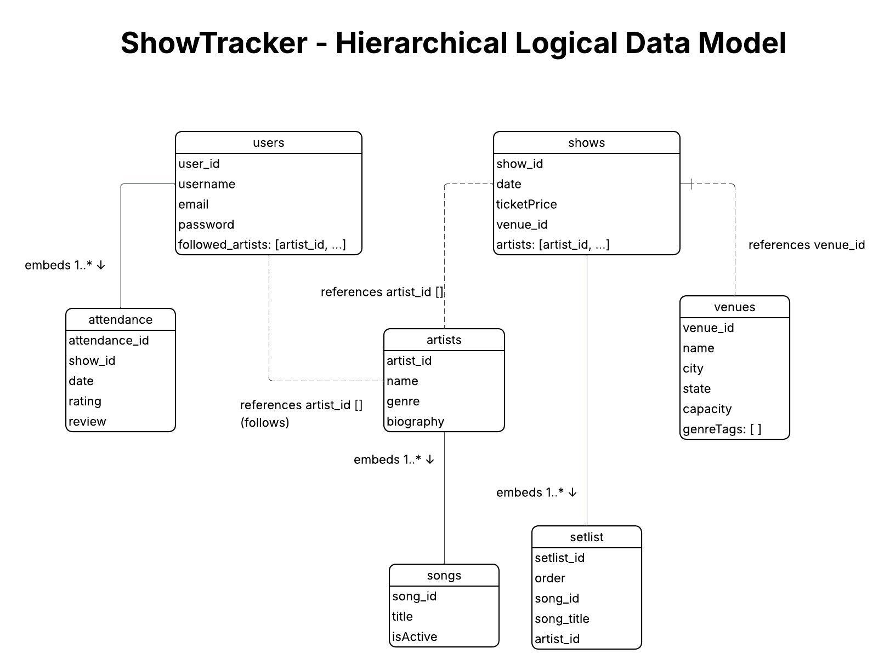

# ShowTracker MongoDB Database

A MongoDB document database adaptation of **ShowTracker**, a platform that lets users track live music show attendance, rate performances, follow artists, and browse setlists across venues. This project adapts the relational database from Project 1 into a document-based model using MongoDB.

---

## Quick Start

```bash
# 1. Restore the database from dump
mongorestore --db showtracker dump/showtracker/

# 2. Or load test data manually
mongosh showtracker data/test_data.js

# 3. Run the web application
cd app
npm install
npm start
```

---

## Repository Structure

```
show-tracker-mongo/
├── README.md                          ← This file
│
├── docs/
│   ├── requirements.pdf               ← [Task 1] Requirements document (reused from Project 1)
│   ├── logical_model.png              ← [Task 2] Hierarchical Logical Data Model diagram
│   └── collections.js                 ← [Task 3] JSON collection definitions with comments
│
├── diagrams/
│   └── uml_class_diagram.png          ← [Task 1] UML Conceptual Model (reused from Project 1)
│
├── data/
│   ├── test_data.js                   ← [Task 4] Test data for all 4 collections
│   └── dump/                          ← [Task 4] mongodump output for database restore
│       └── showtracker/
│           ├── users.bson
│           ├── shows.bson
│           ├── artists.bson
│           └── venues.bson
│
├── queries/
│   ├── query1_aggregation.js          ← [Task 5] Aggregation pipeline
│   ├── query2_complex_search.js       ← [Task 5] Complex search with $and/$or
│   ├── query3_count.js                ← [Task 5] Count for specific user
│   ├── query4_update.js               ← [Task 5] Update/toggle boolean field
│   └── query5_followed_artists.js     ← [Task 5] Lookup followed artists
│
└── app/                               ← [Task 6] Node + Express CRUD application
    ├── package.json
    ├── app.js
    ├── db/
    │   └── mydb.js
    ├── routes/
    │   ├── shows.js
    │   └── venues.js
    └── views/
        ├── partials/
        │   └── header.ejs
        ├── index.ejs
        ├── shows.ejs
        ├── showForm.ejs
        ├── showEdit.ejs
        ├── venues.ejs
        ├── venueForm.ejs
        └── venueEdit.ejs
```

---

## Assignment Deliverables

### Task 1 — Problem Requirements & Conceptual Model (5 pts)

**Files:**
- [`docs/requirements.pdf`](docs/requirements.pdf)
- [`diagrams/uml_class_diagram.png`](diagrams/uml_class_diagram.png)


Reused from Project 1. Describes the ShowTracker problem domain including business rules, candidate nouns and actions, and a UML class diagram with 7 entity classes and full multiplicity constraints:

- **1:N** — Venue hosts Shows
- **1:N** — Artist performs Songs
- **M:N** — Show features Artists (via ShowArtist)
- **M:N** — User attends Shows (via Attendance, carrying `rating` and `review`)
- **M:N** — User follows Artists (via UserFollows)
- **M:N** — Show includes Songs in Setlist (via Setlist, carrying `order`)

---

### Task 2 — Logical Data Model for Document Databases (15 pts)

**File:** [`diagrams/logical_model.png`](diagrams/logical_model.png)



Adapts the relational schema into a document hierarchy with 4 root collections. Each collection becomes a MongoDB collection. Embedding and referencing decisions:

| Collection | Embedded | Referenced |
|---|---|---|
| `users` | `attendance[]` subdocuments | `followed_artists[]` → artist_id refs |
| `shows` | `setlist[]` subdocuments | `venue_id`, `artists[]` → refs |
| `artists` | `songs[]` subdocuments | — |
| `venues` | — | — |

**Design decisions:**
- `attendance` is embedded in `users` because it belongs exclusively to one user and is always queried in that context
- `setlist` entries are embedded in `shows` because they have no meaning outside of their show
- `songs` are embedded in `artists` because they always belong to and are retrieved with one artist
- `venues` and `artists` remain separate root collections because they are shared across many shows and users — embedding would cause duplication

---

### Task 3 — Main Collections Defined in JSON (10 pts)

**File:** [`documents/collections.js`](documents/collections.js)

Defines all 4 collections with 2 example documents each, including inline comments explaining design decisions. Collections:

- `users` — root collection with embedded attendance and artist reference array
- `shows` — root collection with embedded setlist and venue/artist references
- `artists` — root collection with embedded songs array
- `venues` — root collection with scalar fields and genre tags array

---

### Task 4 — Test Data & Database Initialization (15 pts)

**Files:**
- [`data/test_data.js`](data/test_data.js)
- [`data/dump/showtracker/`](data/dump/showtracker/)

| Collection | Documents | Notes |
|---|---|---|
| venues | 4 | Real venues across SF, CO, DC, NY |
| artists | 4 | Phoebe Bridgers, Mitski, Khruangbin, Japanese Breakfast |
| shows | 6 | Including 2 co-headliner shows with multiple artists |
| users | 5 | With varying attendance histories and followed artists |

**To initialize the database:**

Option 1 — Restore from dump:
```bash
mongorestore --db showtracker dump/showtracker/
```

Option 2 — MongoDB Shell:
```bash
mongosh showtracker data/test_data.js
```

Option 3 — MongoDB Compass:
1. Open Compass and connect to `mongodb://localhost:27017`
2. Create a database named `showtracker`
3. For each collection, click ADD DATA → Insert Document and paste the contents of `data/test_data.js`

---

### Task 5 — Queries (30 pts)

All queries are in the [`queries/`](queries/) folder. Run them in MongoDB Shell with `mongosh`:

```bash
mongosh
use showtracker
load("queries/query1_aggregation.js")
```

| Query | Requirement | File | Description |
|---|---|---|---|
| 1 | Aggregation pipeline | [`query1_aggregation.js`](queries/query1_aggregation.js) | Count shows attended per user using `$project` and `$sort` stages, sorted by most attended |
| 2 | Complex search ($and/$or) | [`query2_complex_search.js`](queries/query2_complex_search.js) | Find shows in San Francisco OR Washington DC with ticket price under $50, using `$lookup`, `$and`, and `$or` |
| 3 | Count for specific user | [`query3_count.js`](queries/query3_count.js) | Count total shows attended by user "mwilliams" using `$match` and `$size` |
| 4 | Update/toggle boolean | [`query4_update.js`](queries/query4_update.js) | Toggle `isActive` on song "Funeral" by Phoebe Bridgers using positional `$` operator and `$set` |
| 5 | Lookup/join | [`query5_followed_artists.js`](queries/query5_followed_artists.js) | Find all artist details for artists followed by user "rnguyen" using `$lookup` |

---

### Task 6 — Node + Express Application (25 pts)

**Directory:** [`app/`](app/)

A basic CRUD web application built with Node.js, Express, MongoDB, and EJS templates. Supports full create, read, update, and delete operations for two collections: **shows** and **venues**.

**How to run:**
1. Make sure MongoDB is running locally on port 27017
2. Make sure the `showtracker` database is populated (see Task 4)
3. Then:
```bash
cd app
npm install
npm start
```
4. Open `http://localhost:3000` in your browser

**Features:**
- `/venues` — list, add, edit, and delete venues
- `/shows` — list, add, edit, and delete shows (with venue dropdown)

---

## Video Demo

[Link to YouTube demo](#) ← replace with your YouTube link

---

## AI Usage

AI (Claude by Anthropic) was used throughout this project for the following:

- **Planning** — breaking down project deliverables into phases and creating a work plan
- **Logical Data Model** — designing the document hierarchy, embedding vs. referencing decisions, and LucidChart diagram instructions
- **JSON Collection Definitions** — generating example documents with inline design comments
- **Test Data** — generating realistic JSON data for all 4 collections using real artist and venue names
- **Queries** — generating all 5 MongoDB queries based on rubric requirements and debugging query syntax
- **Node + Express App** — adapting Project 1's SQLite app to use the MongoDB driver, updating all route logic and EJS views
- **README** — generating documentation in the same style as Project 1

All AI-generated content was reviewed, tested, and verified before inclusion in the project.